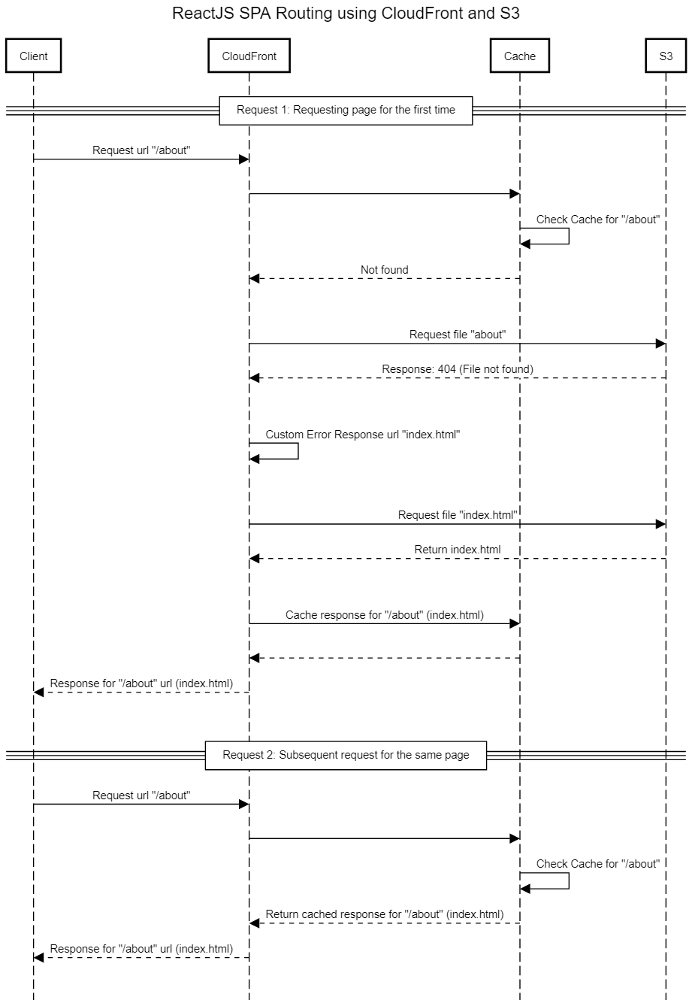

This respository is based on the [react-cors-spa](https://github.com/aws-samples/react-cors-spa) sample code for the AWS Prescriptive Guidance [Deploy a React-based single-page application to Amazon S3 and CloudFront](https://docs.aws.amazon.com/prescriptive-guidance/latest/patterns/deploy-a-react-based-single-page-application-to-amazon-s3-and-cloudfront.html) article. It includes modifications to the ReactJS application and CloudFormation template to support React Router navigation implemented through the [react-router-dom](https://www.npmjs.com/package/react-router-dom) dependency.

Support for route based navigation in the ReactJS single page application is achieved by leveraging the CloudFront Distribution's [Custom Error Responses](https://docs.aws.amazon.com/AWSCloudFormation/latest/UserGuide/aws-properties-cloudfront-distribution-customerrorresponse.html) to replace error response codes and payloads with valid respones corresponding to the index page. The approach is detailed in the [Deploy React Web App on AWS S3 and CloudFront using CloudFormation (via AWS SAM CLI)](https://aws.plainenglish.io/deploy-react-web-app-on-aws-s3-and-cloudfront-using-cloudformation-via-aws-sam-cli-409aa479063d) article.

# Getting Started with the React Cors Application

## Getting started

In the project directory, run the following command to install all modules:
`npm install`

then start the application locally using the following command:
`yarn start`

## Deploying to AWS

In order to deploy to AWS, you have to take the following steps:
1. Deploy the CloudFormation Template from the project (`react-cors-spa-stack.yaml`) using AWS CLI or AWS Console
2. Once your stack is deployed, from the "Output" tab, identify the "APIEndpoint" URL as well as the S3 "Bucket" name
3. Copy the API endpoint URL identified at step 2 and paste it in the App.js line 26
4. Build the (using `yarn build`) app for distribution
5. Upload the content of the `build` folder into the S3 bucket identified at step 2
6. Access the application through the CloudFront distribution created at step 1

## Available Scripts

In the project directory, you can run:

`yarn start`

Runs the app in the development mode.\
Open [http://localhost:3000](http://localhost:3000) to view it in the browser.

The page will reload if you make edits.\
You will also see any lint errors in the console.

`yarn test`

Launches the test runner in the interactive watch mode.\
See the section about [running tests](https://facebook.github.io/create-react-app/docs/running-tests) for more information.

`yarn build`

Builds the app for production to the `build` folder.\
It correctly bundles React in production mode and optimizes the build for the best performance.

The build is minified and the filenames include the hashes.\
Your app is ready to be deployed!

See the section about [deployment](https://facebook.github.io/create-react-app/docs/deployment) for more information.

## Routing

## License

This sample application is licensed under [the MIT-0 License](https://github.com/aws/mit-0).
